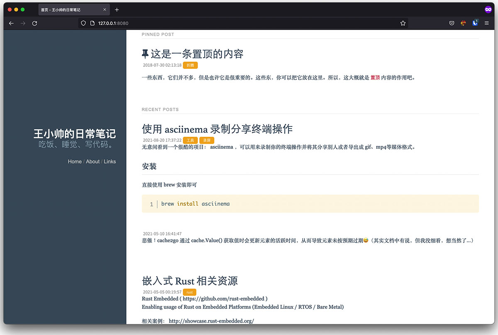

# go-whisper

使用 Go 编写的个人博客系统。

## 功能特性

- [x] Markdown 支持；
- [x] 快速部署：一个二进制文件丢到服务器上搞定，不需要额外的运行环境；
- [x] 低成本运行：其实也不是很低，大概会占用十多M内存；使用 SQLite 数据库； 
- [x] 随意书写：使用标签替代分类，甚至可以不需要写标题；
- [x] 自定义模板： 毕竟程序员的审美……

## TODO
- [ ] 自动备份
- [ ] 图片上传、管理

